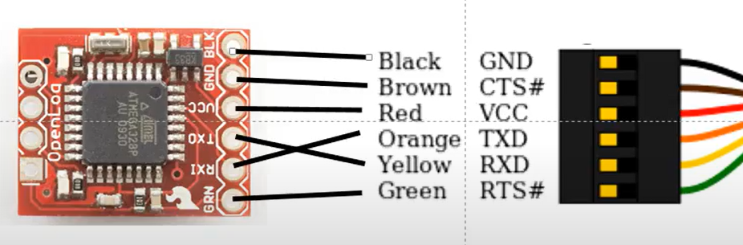
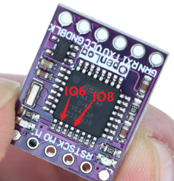

Based on  "v3 Blackbox edition"
https://github.com/sboesebeck/blackbox-firmware/

 
 # Dual Channel edition
 1. Record two channels, can store it into one SDCARD. 
 2. can be configured as mark channel 1 and 2, channle 1 is hardware serial port, the channel 2 is software serial port. 
 3. Using IO6(TX) and IO8(RX) as soft serial port. (We don't use TX function)
 4. 115200 is working. But there is some crashing in bytes due to the soft serial. do not suggest for higher baudrate for dual channel. 
 5. Buffer size is 128 bytes.
 6. 10 bytes time out for recording from buffer to SD card. 
 7. Config file name need to match 8.3 format : "duconfig.txt"

# Connection for downloading

# Location for IO6(TX) and IO8(RX)
